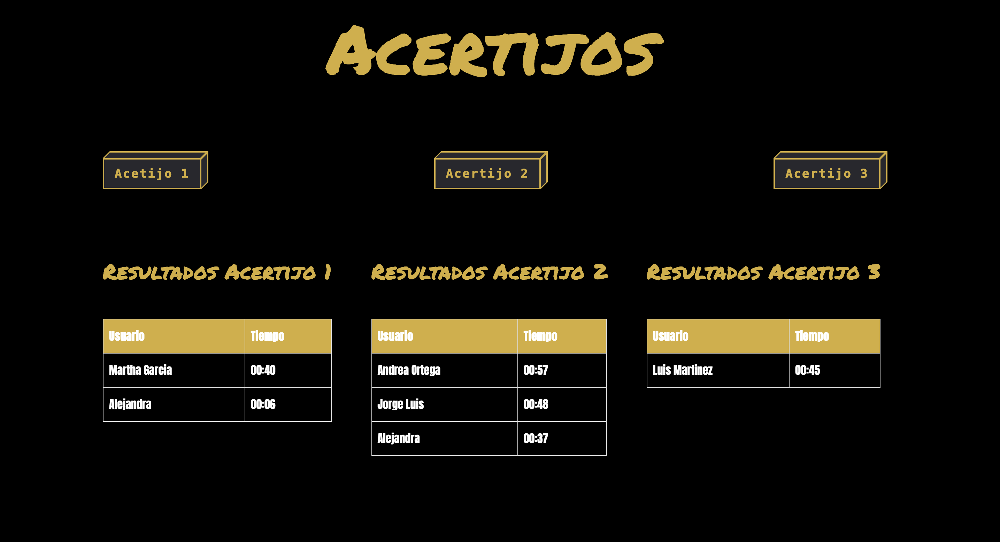

# PruebaTecnica - Acertijos
###### Por: Luis Fernando Martínez Rueda

### Requisitos para correr el proyecto

- Node.js
- NPM
- Visual Studio Code

### Instrucciones para correr el proyecto
###### Si ya cuentas con todos los requisitos saltarse al punto 2

# **Punto 1** -> Instalación de Requisitos

## NodeJS y NPM
### Ingresa a sitio oficial de Node, y podrás descargarlo
#### **Link:** https://nodejs.org/en

## Verificar que tengas instalado ambos paquetes, sigue estos pasos:

- Se debe entrar a un cmd (Windows) o Terminal (MacOS).
- Colocar el comando **node -v** y darle enter. Si todo se instaló bien, debe aparecer en pantalla, la información de la versión del paquete como: **v22.0.0**
- Posteriormente colocar el comando **npm -v** y darle enter. Si todo se instaló bien, debe aparecer en pantalla, la información de la versión del paquete como: **v22.0.0**

## Visual Studio Code
### Ingresa a sitio oficial de Visual, y podrás descargarlo seleccionando el sistema operativo de tu computadora.
#### **Link:** https://code.visualstudio.com/download

# **Punto 2** -> Instalación de proyectos

### En este repositorio se podrán encontrar con dos carpetas:

- APIs (La base de datos en NodeJs)
- Los Acertijos (El proyecto en react)

### Sigue los siguientes pasos para poder correr ambas proyectos

## 1. Bajar archivos

### Se deberán bajar ambas carpetas a su computadora.
### Pasos:
- En la pantalla del repositorio, se mostrará un botón verde con un texto de "<> Code>.
- Una vez localizado del botón, dar click.
- Se mostrarán varias opciones. Elegir "Download ZIP".
- Ir al directorio de descargas y descomprimir la carpeta. 
- **Windows:** click derecho, Extrarer todo.
- **Mac:** Dar doble click al archivo (En caso de que ya no esté comprimido).

## 2. Abrir archivos en Visual Studio Code

### Se deberá abrir esta carpeta en el IDE de Visual Studio Code.
### Pasos:
- **Windows:** Abrir Visual Studio Code y arrastrar la carpeta a la venta de la aplicación.
- **Mac:** Abrir Visual Studio Code y arrastrar la carpeta a abrir, al icono de la aplicación.

## 3. Instalar dependencias

### Se deberán instalar dependencias para que el proyecto corra satisfactoriamente.
### Pasos:
- Abrir terminal: Presionar el segundo icono que tiene el borde en la parte inferior. Estos iconos se encuentran en la parte superior derecha de la aplicación:

- Se abrirá una pantalla inferior donde se podrá visualizar una terminal. Posterior a esto, debemos darle click al icono de terminales en dos, como se muestra en la imagen. 

- Para este momento, ya deberían haber dos terminales. 
- En cada una de las terminales, debemos acceder a cada una de las carpetas. 
- Escoge una de las dos terminales y pon el comando **cd APIs/** y darle Enter
- Escoge la segunda de las dos terminales y pon el comando **cd LosAcertijos/** y darle Enter

### Imagen antes del Enter

### Imagen después del Enter

- En la terminal donde usaste el comando de  **cd APIs/**, se deberá poner los siguientes comandos. Toma en cuenta que se debe escribir un comando y después darle Enter, y posteriormente escribir el otro y volver a poner Enter

### Los comando en esta terminal (APIs)
- **npm install**
- **node server.js**

##### Con estos comandos ya debería de estar corriendo este servidor como se muestra en la siguiente imagen.

- Para la segunda terminal, debemos escribir los siguientes comandos. Toma en cuenta que se debe escribir un comando y después darle Enter, y posteriormente escribir el otro y volver a poner Enter. 

### Los comando en esta terminal (LosAcertijos)
- **npm install**
- **npm run dev**

##### Con estos comandos ya debería de estar corriendo este servidor como se muestra en la siguiente imagen.

- Como se muestra en pantalla de esta terminal, nos dará un link de localhost para poder visualizar el proyecto. Debemos copiar y pegar este link en nuestro navegador preferido y podremos navegar en el sitio web. 

### Al final debemos de tener algo así en nuestras terminales

### Y en nuestro navegador, se visualizará algo como esto:

